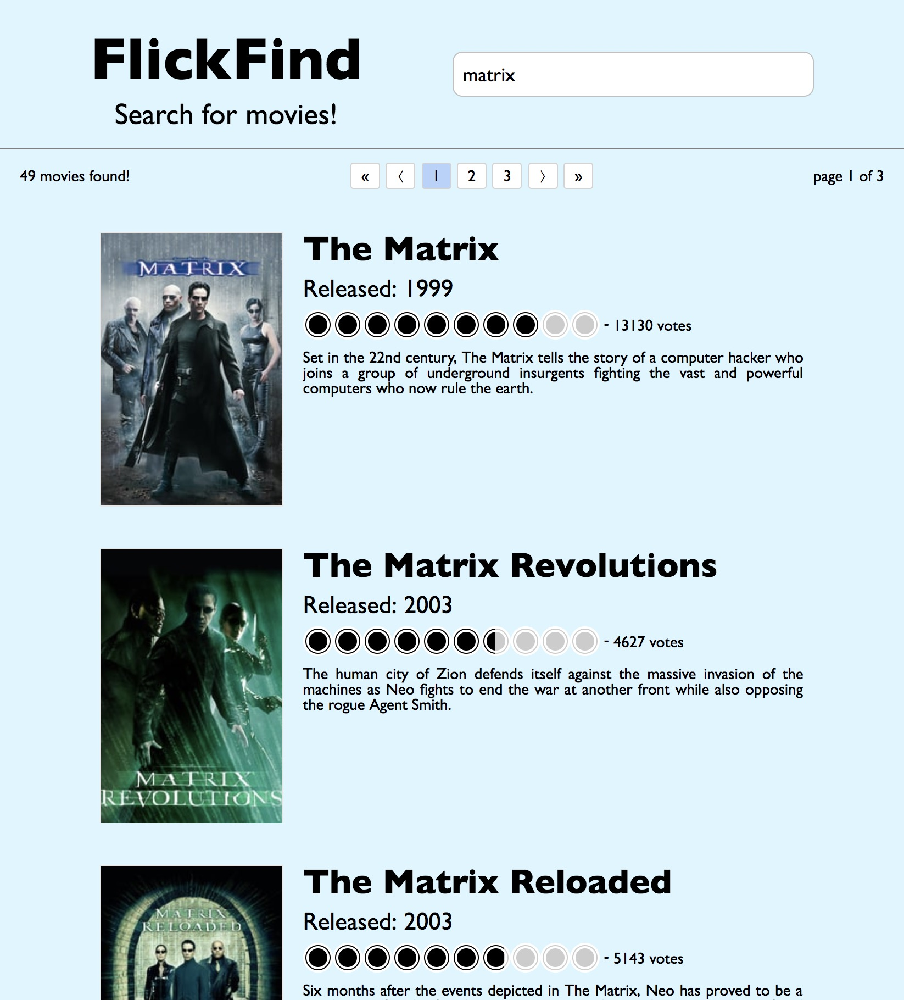

# FlickFind
### A Movie Search App

### [LIVE DEMO](https://youngmanalive.github.io/flickfind)

FlickFind is a simple React driven app that allows you to search for movies using [The Movie Db](https://www.themoviedb.org)'s API (version 3).



This project was bootstrapped with `create-react-app`.

Dependencies:
- [`create-react-app`](https://www.npmjs.com/package/create-react-app)
- [`react-js-pagination`](https://www.npmjs.com/package/react-js-pagination) to handle paged results
- [`react-rating`](https://www.npmjs.com/package/react-rating) to display voter ratings

# Usage

Download or clone this repository and run:

```
npm install
```

**You will need an API key to access TMDb's endpoint.**

Get yours [HERE](https://developers.themoviedb.org/3/getting-started/introduction).

Once you've obtained a key you can:

1. Create a `keys.js` file to be ignored by git:
  ```JavaScript
  // src/config/keys.js

  export const API_KEY = "your key here";
  ```

2. Add your key directly into the `api_util.js` file:
  ```JavaScript
  // src/config/api_util.js

  const BASE_URL = "https://api.themoviedb.org/3/search/movie?";
  const API_KEY = "your key here"; // <<<< Your key
  // const API_KEY = require('./keys').API_KEY; <<<< Remove this
  
  // ...
  ```

If you plan on having public code I recommend the first option.


Then:
```
npm run start
```
You should be up and running! Enjoy.

# Notes
- Heirarchy:
  - `App` - holds all state and handles fetching
    - app title and search input
    - `MovieIndex` - displays search results passed in from `App`
      - `Pagination` - handles result pages
      - `MovieIndexItem`

- `api_util.js` - API endpoint logic (`fetch`) and image url building

- When running searches TMBd will respond with the total amount of pages (20 movies per page) and will default to page 1. You can query for the page number so long as you don't exceed 1,000. With this boundry the total results on the app can never exceed 20,000. (see `handleFetch` in `app.js`)

- Not all movies have poster images, so we'll default to a svg icon


## Future Directions
- Shareable Search: A simple solution could use a URL hash:
  - When the component mounts, check `location.hash` and run the search accordingly.
- Sorting: Not sure how feasible this is since we only get 20 movies per request
- Click on poster image and open full size image in new tab
- Search history
- Random movie search
- Enable search filters such as year released
